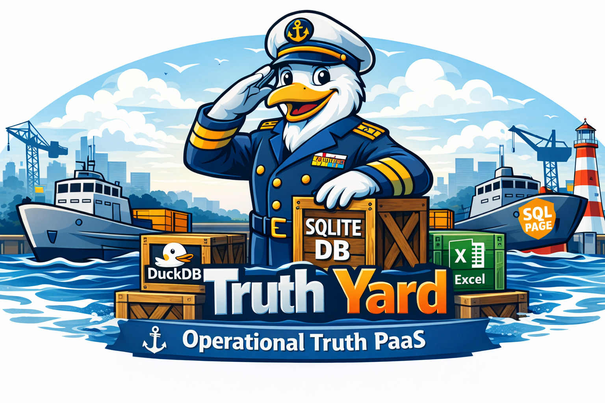

`db-yard` is a file-driven process yard for “SQLite DB cargo.” It scans your
cargo folder, detects which databases are exposable (SQLPage apps and surveilr
RSSDs), spawns each one as a local web service, writes a durable context JSON +
logs to disk, and exits. There is no registry and no internal control-plane
database. The filesystem is the control plane.

A SQLite file on disk is cargo. Dropping cargo into the yard makes it eligible
to be launched. The spawned-state directory is the operational ledger: context
manifests and logs are written to disk so other tools (and later invocations of
`yard.ts`) can see what is running without needing an API.

Mental model: a “Navy Yard”

- The yard is a place where cargo crates get launched as vessels.
- Databases are cargo crates.
- Spawned processes are launched vessels.
- Ports are berths.
- JSON context files are manifests you can hand to other tools (proxy config
  generation, status, kill).

## What `yard.ts` does today

The current CLI is intentionally small and deterministic:

- `yard.ts start` spawns everything it can find under `./cargo.d`, writes state
  into `./spawned.d/<timestamp>/...`, then exits.
- `yard.ts ls` scans `./spawned.d` and prints what it finds (alive/dead, URLs,
  kind/nature).
- `yard.ts kill` terminates processes referenced by the spawned-state ledger
  (optionally removes the ledger).
- `yard.ts proxy-conf` generates reverse proxy configs (NGINX and/or Traefik)
  from the spawned-state ledger.

This is not a long-running filesystem watcher in the CLI you’re using right now.
If you want “watch and reconcile continuously,” that’s a separate orchestration
mode and can be layered on later. The current “materialize then exit” contract
is deliberate.

How spawning works

1. Discovery `yard.ts start` walks `./cargo.d` (recursively) looking for files
   that match the default globs used by `tabular()` (for example: `**/*.db`,
   `**/*.sqlite`, `**/*.sqlite3`, `**/*.sqlite.db`, `**/*.duckdb`, `**/*.xlsx`).

2. Classification Each candidate is classified using lightweight checks:

   - If it’s an SQLite-like file:

     - If it has table `uniform_resource`, it is treated as a surveilr RSSD and
       spawned via `surveilr web-ui`.
     - Else if it has table `sqlpage_files`, it is treated as a SQLPage app and
       spawned via `sqlpage`.
     - Else it is treated as plain SQLite (not exposable) and ignored by
       `exposable()`.
   - Excel and DuckDB may be detected as tabular suppliers, but they are not
     exposable services in the current spawn pipeline.

3. Exposure decision Exposable services are assigned a proxy prefix derived from
   the file’s path relative to the cargo root. Example:

   - `cargo.d/controls/scf-2025.3.sqlite.db` becomes
     `/controls/scf-2025.3.sqlite`
   - `cargo.d/two/example-two.db` becomes `/two/example-two`

4. Port allocation Ports are assigned incrementally starting at 3000 (in the
   current defaults).

5. Spawning A child process is launched for each exposable service with
   stdout/stderr redirected to log files, so `yard.ts` can exit cleanly without
   keeping the event loop alive. Context is written to a JSON manifest file
   alongside the logs.

6. Spawned-state ledger Every spawned service writes:

   - `<db file>.context.json`
   - `<db file>.stdout.log`
   - `<db file>.stderr.log`

Session directories and file layout

Each `yard.ts start` creates a new timestamped session directory inside
`./spawned.d`.

Example cargo:

```
cargo.d/
  controls/scf-2025.3.sqlite.db
  controls/another.sqlite.db
  tem.sqlite.db
  three/example-three.sqlite.db
  two/example-two.db
```

Example session output:

```
spawned.d/2026-01-07-20-15-00/
  tem.sqlite.db.context.json
  tem.sqlite.db.stdout.log
  tem.sqlite.db.stderr.log

  controls/
    scf-2025.3.sqlite.db.context.json
    scf-2025.3.sqlite.db.stdout.log
    scf-2025.3.sqlite.db.stderr.log
    another.sqlite.db.context.json
    another.sqlite.db.stdout.log
    another.sqlite.db.stderr.log

  three/
    example-three.sqlite.db.context.json
    example-three.sqlite.db.stdout.log
    example-three.sqlite.db.stderr.log

  two/
    example-two.db.context.json
    example-two.db.stdout.log
    example-two.db.stderr.log
```

A key point: the session subdirectories mirror your cargo folder layout. This
makes it easy to correlate a service back to its source file and keeps large
cargo trees readable.

CLI overview (current yard.ts)

```bash
# start everything exposable under ./cargo.d, write state into ./spawned.d, then exit
bin/yard.ts start [--verbose essential|comprehensive] [--summarize] [--no-ls]

# list what the spawned-state ledger says exists (alive/dead, upstream URL, kind/nature)
bin/yard.ts ls

# kill processes referenced by the spawned-state ledger
bin/yard.ts kill [--clean]

# generate reverse proxy configs from spawned-state ledger
bin/yard.ts proxy-conf [options]

# helpers
bin/yard.ts help
bin/yard.ts completions
```

Verbosity

`start` accepts an enum `--verbose`:

- `--verbose essential` prints lifecycle events without the full detail stream.
- `--verbose comprehensive` prints full discovery/spawn/context/probe details.
- omit `--verbose` to run quietly (no event stream).

Examples:

```bash
bin/yard.ts start
bin/yard.ts start --verbose essential
bin/yard.ts start --verbose comprehensive --summarize
```

Listing processes

`yard.ts ls` reads the spawned-state ledger and prints one line per context
file, including:

- PID and whether it is alive
- the upstream URL (base URL + proxy prefix)
- service kind and supplier nature (for example: `sqlpage/embedded`,
  `surveilr/embedded`)

Example output:

- 🟢 [123400]
  [http://127.0.0.1:3000/controls/scf-2025.3.sqlite](http://127.0.0.1:3000/controls/scf-2025.3.sqlite)
  (sqlpage/embedded)
- 🔴 [123406 (dead)]
  [http://127.0.0.1:3001/controls/another.sqlite](http://127.0.0.1:3001/controls/another.sqlite)
  (sqlpage/embedded)

Killing processes

`yard.ts kill` terminates processes referenced by the spawned-state ledger.

- Without `--clean`, it kills what it can and then you can run `yard.ts ls` to
  see what’s still alive.
- With `--clean`, it removes `./spawned.d` after killing.

```bash
bin/yard.ts kill
bin/yard.ts kill --clean
```

Reverse proxy configuration

`yard.ts proxy-conf` generates NGINX and/or Traefik configs by reading the
spawned-state ledger (context JSON files). This is the “filesystem is the API”
story in action: the context files already contain everything needed to route
traffic.

Common usage patterns:

Emit nginx config to stdout (default):

```bash
bin/yard.ts proxy-conf --type nginx
```

Write nginx configs to a directory:

```bash
bin/yard.ts proxy-conf --type nginx --nginx-out ./out/nginx
```

Write traefik configs to a directory:

```bash
bin/yard.ts proxy-conf --type traefik --traefik-out ./out/traefik
```

Write both:

```bash
bin/yard.ts proxy-conf --type both \
  --nginx-out ./out/nginx \
  --traefik-out ./out/traefik
```

Important options you can use (as implemented in the updated `yard.ts`):

- `--include-dead` include dead PIDs when generating configs (default is to only
  include live ones, depending on generator behavior)
- `--location-prefix <prefix>` override the proxy prefix for all services
- `--strip-prefix` enable prefix-stripping middleware/rewrite
- nginx-specific:

  - `--server-name <name>` (default `_`)
  - `--listen <listen>` (default `80`)
  - `--nginx-extra <text>` extra snippet appended into server block
- traefik-specific:

  - `--entrypoints <csv>` (default `web`)
  - `--rule <rule>` router rule override
  - `--traefik-extra <text>` extra yaml appended at end

Notes for SQLPage and surveilr behind a proxy

db-yard spawns services with a “site prefix” concept so that apps can behave
correctly when mounted behind a reverse proxy. The proxy prefix is derived from
the cargo-relative path (unless overridden). When you generate proxy configs,
you are basically publishing that same prefix at your reverse proxy layer.

Operational ledger as the contract

The spawned-state directory is the contract between:

- spawning (materialize/start)
- inspection (ls)
- cleanup (kill)
- reverse proxy generation (proxy-conf)

No shared memory, no background daemon required. If a tool can read files, it
can integrate with db-yard.
